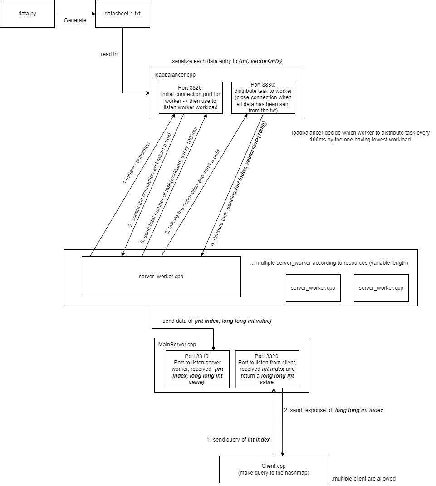

# BoostAsio-LoadBalancer
I started this project to learn the boost::asio library, I challenge myself to finish it in 3 weeks. 

# Time
From 23 Devember 22 to Jan 15 2023, Around 29 hours in Total

# What I learn ?

First time using boost asio library, been able to learn concept related to sockets. However it did not work so well as the time is so limited for me to challenge myself. I will further contribute to it after I am more free.

## First time
- use boost asio library , require me to learn some basic concept of socket programming 
- use `unique_ptr()` to store socket in map
- pass data through different socket

## Area of improvement
- [ ] there is definitely something wrong for the loadbalancer to get the workload of the socket, should there be an sleep_for(10ms)?


## How to improve in next project
- [ ] I might need to stop doing new project in cpp, but learn more cpp concept and computer science concept such as operating system, computer architecture. 
    - [ ] cpp concept can be learn by reading books like c++ primer, effective modern c++, concurrency in action
    - [ ] CS knowledge can be learn by course like Nand2Tetris, 

## Further stuff to learn
- [ ] Understand blocking vs non-blocking , this is a challenge for me when understanding `async_read` vs `read` 
- [ ] Understand ownership concept, `unique_ptr()` , `std::move()` 

## Difficulties
There is a big challenge in time management. I wish to work more in christmas time, but I need to meet friends during most of the time. While in non-holiday period, I feel tired easily after work which lead to lower learning efficientcy. 

Another challenge is debugging. 
## How I overcome 
I try to wake up at 6 am in the morning start to code a bit before work. 

I should learn tools like gdb to help me debugger
## Error/Bug still existing
- [ ] only one worker could work right now, so there is some logic error leading to the load balancer cannot really distribtue task to different server
- [ ] There is not any valdiation on user opening the worker before the load balancer start working

## To - do
- [ ] support multiple worker
- [ ] unit test and benchmarking

## Notes
syntax of reading and writing a vector
```cpp
vector<int> vc(100);
boost::asio::read(socket,boost::asio::buffer(vc));
```

```cpp
vector<int> vc(5) = {1,2,3,4,5};
boost::asio::write(socket,boost::asio::buffer(vc));
```
# Details:



# Generate datasheet :  
- This will generate a txt file named `datasheet-1.txt` 
- The first number in each row is the index of the map that will be inserted ranged from `0` to `65535`
- Followed by `1000` number which will be used to calculated as the sum to insert as the coressponding value of the index ranged from `-32768` to `32767`  
- by default there will be 500,000 line of data

### Run the following code : 
```
python3 data.py
```

# Compile the program 
### Run the following code :  
(without make at the moment, will include in the future)
```
mkdir build 
cd ./build
cmake ..
make 

//split the terminal

//terminal 1
./LoadBalancer

//terminal 2
./MainServer

//terminal 3 , run after you make sure ./LoadBalancer and ./MainServer had start the port listening 
./Worker_Server

//terminal 4
./Client
//enter you query here
```

# Explanation of each file (This is not updated)
## client.cpp 
- a client program which connect to `mainserver.cpp ` for querying by providing the index and receive the value stored in the hashmap
## mainserver.cpp 
- Include 2 seperated server program 
    - A hashmap server which receive index and sum of data from `Worker_Server.cpp`, then store it to the hashmap
    - A query server which receive the index from `client.cpp` and return the the corresponding value in the hashmpa 
## loadbalancer.cpp 
- read in data from 
- send the serialized data to `worker_server.cpp`
## Worker_Server.cpp 
client.cpp -> for querying the hash map
mainserver.cpp -> for storing the hashmap and answer client.cpp query
worker_server.cpp -> sum up the vector and return a int index and long long int sum
loadbalancer.cpp -> read in the txt, send the vector and 

 

